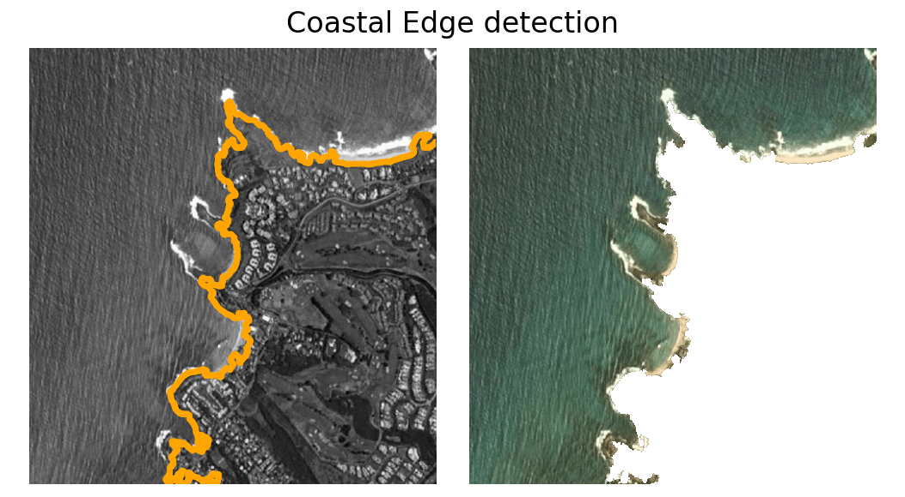
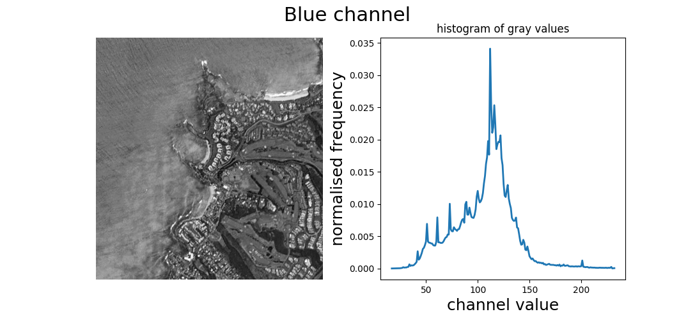
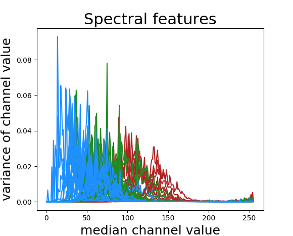
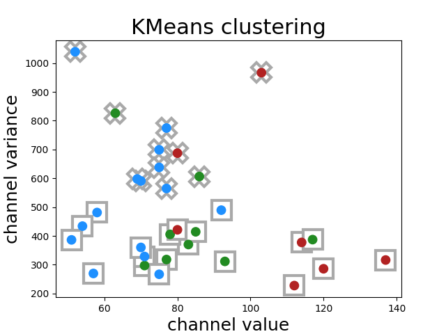

# Kapalua Bay Visbility Report
[](https://www.gnu.org/licenses/gpl-3.0)

Daily snapshots of Kapalua bay (at 10:30am local time) can be used to estimate weather the conditions in the bay are _good_ or _bad_. While this is clearly a subjective classification depending if you are a surfer or a snorkeller, it may be of some value to someone.

- - -

## Objective
Good conditions in the bay can be qualitatively described with two metrics: smooth surface and clear water. Conversely, bad conditions can be identified by choppy waves and sediment suspended in the water. Both of these effects are likely to be reflected in the colour and "texture" of the bay. These macroscopic properties should be identifiable using remote sensing.


## Satellite Data
The daily snapshots are taken from [Planet](https://www.planet.com), from the 4-band PlanetScope Scene satellites with 3m spatial resolution. Imagery was only selected if it had high coverage of Kapalua bay and minimal cloud coverage, although this will lead to bias (discussed later). The raw imagery strips are ~200mB, with only a fraction relating to Kapalua bay. As such, the data collected was taken via screenshot of an approximately fixed geometry around the bay. More detailed analysis could use the full imagery, but would also increase the computation time.

The raw data used can be found in the `data/` folder, along with a file manually classifying good, okay, and bad days.

## Analysis
There are three main stages to the automated analysis, delinated below:

+ Feature identificaton
+ RGB extraction
+ Classification
  + train/test datasets
  + classify new days
  
The full implementation can be found in `scripts/analysis.py`.
  
#### Feature identification
In order to accelerate the analysis, we need to detect the coastal edge without user input. This allows a greater range of sites to be tested given raw data with "supervised" detection rather than manual. This was achieved by singling out the blue channel of the image, and using several image analysis techniques. The first was to roughly extract edges through a [Sobel operator](https://en.wikipedia.org/wiki/Sobel_operator) . Next was to apply a [watershed filter](https://en.wikipedia.org/wiki/Watershed_(image_processing)), with any resulting small holes filled in. This provided a fairly good outline of the coast, which was then used to mask out all "land" within the image.



A section of the code is shown below.
```python
def getOceanBoundary(image_full):
    image = image_full.copy()[...,2]
    elevation_map = sobel(image)

    markers = np.zeros_like(image)
    markers[image < 30] = 1
    markers[image > 150] = 2
    
    segmentation = morphology.watershed(elevation_map, markers)
    segmentation = ndi.binary_fill_holes(segmentation - 1)

    contours = measure.find_contours(segmentation, .8)
    main_contour = sorted(contours, key = len, reverse = True)[0]

    coastal_edge = morphology.remove_small_objects(segmentation,10000)
```

#### RBG extraction
With only ocean remaining in the image, histograms can be generated for each channel in red, green, and blue. In order to easily compare these normalised histograms, several coarse-grainings were made. We took the median and variance of the underlying data for each channel, providing a rough quantification of ocean colour, as well as how homogeneous those colours were.

```python
 MI = maskImage(image[:min_x,:min_y],new_bound).astype(float)
 MI[MI==0]=np.nan      
        
 features=[]
 RGB_channels=range(3)
 for i in RGB_channels:
     features.extend([np.nanmedian(MI[...,i]),np.nanvar(MI[...,i])])
     h,hc=getGreyscaleHistogram(maskImage(image[:min_x,:min_y],new_bound),i)
     plt.plot(hc,h,c=cols[day_classes[ID]])
            
 full_features.append(features)
 class_.append(day_classes[ID])
```



The combined channel results are shown below. The 'good' days are in blue, the 'okay' are in green, and the 'bad' are in red. The individual RGB channels are not distinguished by colour.



#### Classification
Although the collected dataset was fairly small (~30 samples) due to the stringent conditions on high coverage and low cloud presence, we can still turn to **machine learning** to see if it can be of any use. Two different approaches were used: K means clustering and support vector machines, with strengths summarised below.

|              | KMeans       | SVM            |
|--------------|--------------|----------------|
| Human input? | unsupervised | supervised     |
| Purpose      | clustering   | classification |
| Kernel used  | linear       | RBF            |

With median and variance per colour channel, there were six features per image that can be passed to either technique. 

**KMeans**

The clustering was repeated many times with random initial seeds and an overall agreement was taken. The results can be visualised by displaying a single channel, in this case the blue channel.

Clearly the clustering is not very effective, because the data has a lot of overlap.



The confusion matrix was 

| 15 | 9  |
|----|----|
| 4  | 2  |


**SVM** 

The SVM was more likely to perform better, allowing the SVM to be trained on a subset of the data and tested on the remainder. Because incorrect classifications of the train data lead to a punishment, the SVM should adapt better to the partial overlap beteen "not terrible" (bad) and "not great" (good) days. The reesults were cross validated using a split shuffler, taking 80% of the data to be train and 20% to be test, and repeating this process 1,000 times. The overall score can be found by taking the average classification power of the trained SVM on the test data.

```python
def MLSVM(data,classes,ax):
    classes = np.array([1 if c != 'bad' else 0 for c in classes])
    scaler = StandardScaler()
    scaler.fit(data)

    clf = SVC(gamma='scale')
    cv = ShuffleSplit(n_splits=1000, test_size=0.2)
    scores = cross_val_score(clf, data, classes, cv=cv)
   
    return np.mean(scores),np.sqrt(np.var(scores)/len(scores))
```

The final results were a **mean accuracy of 0.777 ± 0.004**. Since random guessing would be an accuracy of .5, then this did do something.

## Discussion
Overall, there was a positive result using the SVM classifier, which was ultimately surprising given the prototype nature of this idea and lake of rigor in the screenshotted imagery. With 2 classes, 6 features, and 31 images, overfitting shouldn't be a significant risk, as seen from the low variance in the cross validation. However, the analysis could certainly use some more detail.

However, if you want to see if the ocean conditions in Kapalua bay are good before you go, maybe this will be a useful proxy for having eyes on-site!

### Limitations
Unforunately if this was to scale, this section would be rather long. Some main limitations are described, with potential fixes.

+ Satellite variation
  + different colouration (inherent)
    + inherent to satellite
	+ daily conditions (solar properties)
	+ drought/rain on land colour
	+ seasonal conditions
  + selection bias
    + cloudy days are probably worse conditions and are ignored
+ Coastal edge detection
  + ocean/land spectral overlap
    + cuts too much/little land out in the mask
	+ incorrect colour data of the ocean
  + fixed mask of edge
    + image georeferencing not perfect
	+ screenshot variation on exact geomtry
+ Feature analyis
  + distributions are more complex than median and variance
    + choppy water likely to have many smaller peaks
  + colour channels are unlikely to be uncorrelated
    + 6 features really may be just 2
	
- - -

## Conclusion
A fun introduction in manipulating satellite imagery into _actionable_ information. It seemed to work at times, but not very conclusively, and not tested to make sure the mechanisms were correct. However, I'd probably still rely more on weather and wind forecasts than this. 
  
  
:octopus: :tropical_fish: :whale2:
